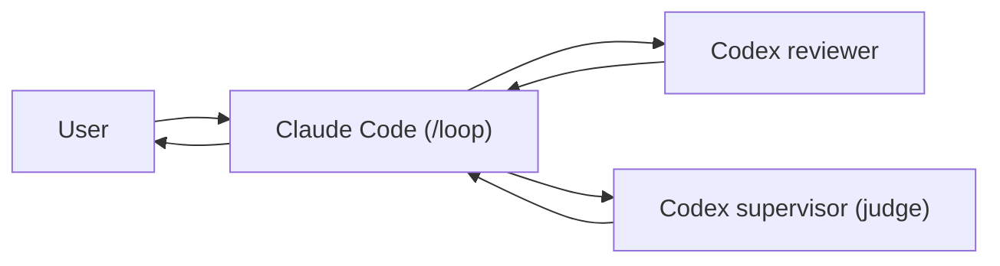

# Review Loop Runbook

このリポジトリでは、Claude Code の `/loop` を司令塔にして、shell script 経由で 2 本の CodexCLI を呼び出します。

- reviewer
  - 変更ファイルを read-only でレビューする
- judge
  - reviewer の集約結果を見て `fix / continue / done / human` を判定する supervisor

## 役割分担



- Claude
  - 実装する
  - 現在の job 状態を見る
  - reviewer と judge を shell script で呼ぶ
  - supervisor の decision に従って次ラウンドを進めるか止める
- Codex reviewer
  - 最大 3 ファイル単位で read-only レビューする
- Codex supervisor
  - reviewer 集約結果と進捗を見て進行判断する
  - 詳細レビューではなく優先順位付けと停止条件の判定を担当する

## 使うファイル

- [CLAUDE.md](/Users/nakata/Claude/clabotch/CLAUDE.md)
  - Claude が `/loop` 中に従う常設ルール
- [AGENTS.md](/Users/nakata/Claude/clabotch/AGENTS.md)
  - reviewer が従う read-only ルール
- [README.md](/Users/nakata/Claude/clabotch/.claude/review-loop/README.md)
  - コマンド一覧
- [.claude/review-loop/SUPERVISOR.md](/Users/nakata/Claude/clabotch/.claude/review-loop/SUPERVISOR.md)
  - judge が従う supervisor ルール
- `runtime/<job>/state.json`
  - job の現在状態
- `runtime/<job>/goal.md`
  - その job の目的
- `runtime/<job>/rounds/NNN/`
  - 各ラウンドの summary, reviewer, judge 結果

## active job の決まり方

Claude は [CLAUDE.md](/Users/nakata/Claude/clabotch/CLAUDE.md) の Review Loop 運用に従って active job を選びます。

1. `.claude/review-loop/runtime/*/state.json` を確認する
2. `smoke-` で始まる job は無視する
3. 非 smoke job が 1 件ならそれを使う
4. 非 smoke job が複数ある場合は、ユーザーが会話またはコマンドで job 名を明示指定していなければ、runtime state は更新せずにユーザーにどの job を使うか確認して停止する
5. 非 smoke job が 0 件なら review-loop は未初期化として扱う

## 開始手順

1. リポジトリへ移動する

```bash
cd /Users/nakata/Claude/clabotch
```

2. job を作る

```bash
.claude/review-loop/bin/init_job.sh \
  --job-name review-loop-setup \
  --goal-template review_loop_setup
```

3. loop prompt を生成して内容を確認する

```bash
.claude/review-loop/bin/render_loop_prompt.sh \
  --job-name review-loop-setup
```

このスクリプトは、対象 job のコマンド一覧と各 tick の動作手順を出力します。
出力内容を確認し、job 名・リポジトリパス・利用コマンドが正しいことを検証してください。

4. Claude Code セッションを開く

5. Step 3 の出力を Claude に貼り、続けて以下を送る

```text
review-loop-setup を active job として使い、CLAUDE.md の Review Loop 運用に従って進めてください。
```

6. そのセッションで `/loop` を開始する

## `/loop` 中の基本動作

Claude は各 tick で次を行います。

1. `status.sh` で state を読む
2. `done` なら完了報告して止まる
3. `human` なら判断待ちを報告して止まる
4. `init / fix_requested / continue_requested` なら:
   - 必要な実装または追加確認を行う
   - summary markdown を runtime 配下に保存する
   - `record_claude_round.sh` を実行する
   - `run_reviewer.sh` を実行する
   - `run_judge.sh` を実行する
5. `reviewing` で止まっていたら reviewer から再開する
6. `judging` で止まっていたら judge から再開する

## 人が見るコマンド

状態確認:

```bash
.claude/review-loop/bin/status.sh --job-name review-loop-setup
.claude/review-loop/bin/status.sh --job-name review-loop-setup --json
```

goal テンプレート確認:

```bash
.claude/review-loop/bin/templates.sh
.claude/review-loop/bin/templates.sh --show review_loop_setup
```

## 状態の意味

- `init`
  - まだ Claude のラウンド未記録
- `reviewing`
  - reviewer 実行待ち
- `judging`
  - judge 実行待ち
- `fix_requested`
  - 修正して次ラウンドへ進む
- `continue_requested`
  - 追加確認や追加レビューを優先する
- `done`
  - 完了
- `human`
  - 人手判断待ち

## 運用メモ

- reviewer / judge はどちらも `codex` を read-only で使う
- judge は `SUPERVISOR.md` に従い、進行判断だけを行う
- summary markdown は runtime 配下に置く
- 変更は小さく保つ
- 重大指摘を優先する
- 要求にない大規模リファクタはしない
