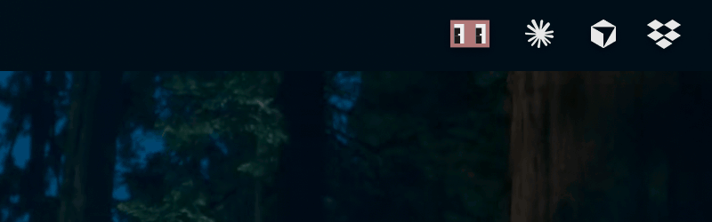

# Clabotch

**Claude Code の作業状態を表示する、macOS メニューバーマスコットアプリ。**

[English README](README.md)

Clabotch（クラボッチ）は macOS メニューバーに常駐するドット絵マスコットです。[Claude Code](https://claude.ai/code) のリアルタイム状態を表示します。PNG 素材ゼロ。全フレームを純粋な Swift コードで描画しています。キャラクター本体は 20×14 px で、メニューバーのスロット内に中央配置されます。

Clabotchのキャラクターのデザインは Claude Code 専用ターミナルマスコット Clawd の配色とドットライクな絵柄と、68K Classic Macintosh のデスクアクセサリ「Eyeballs」——アップルメニューからカーソルを目で追い続けた、あの小さな目玉アプリ。これら2つのオマージュから生まれました。



---

## できること

| Claude Code の状態   | Clabotch の動き                                  |
| -------------------- | ------------------------------------------------ |
| Idle（待機）         | 目を休め、右下を見つめる                         |
| Thinking（思考中）   | 静止表情、軽く頷く                               |
| Responding（応答中） | 目が左右に動く、_「作業中…」_ 吹き出し           |
| ツール実行中         | ツール別吹き出し（例: Bash → _「実行します…」_） |
| Done（完了）         | 虹色スピン + ジャンプ + _「完了！(3分42秒)」_    |
| Error（エラー）      | シェイクアニメーション + _「エラーが出ました…」_ |
| Sleeping（スリープ） | 目を閉じる                                       |

> 💬 吹き出し文言はローカライズ済みです。英語・日本語をサポートし、英語がフォールバックです。

Claude Code の hooks から Unix domain socket 経由でイベントを受信します。Claude Code の内部をポーリングしたり、ネットワーク通信を行ったりは一切しません。

---

## 必要環境

- macOS 13 Ventura 以降
- Xcode 15+ / Swift 5.9+
- [XcodeGen](https://github.com/yonaskolb/XcodeGen)（`brew install xcodegen`）
- `jq`（`brew install jq`）— hook スクリプトが使用
- [Claude Code](https://claude.ai/code)（hooks 連携に必要）

---

## クイックスタート

### 0. ダウンロード（またはソースからビルド）

[**Releases**](https://github.com/nakatadesign/Clabotch/releases) から最新の DMG を取得し、Clabotch.app を Applications にドラッグしてください — その後は手順 3 へ。

> 現在のビルドは ad-hoc 署名です（公証は今後対応予定）。初回起動が macOS にブロックされた場合は「**システム設定 → プライバシーとセキュリティ → このまま開く**」を押すか、`xattr -d com.apple.quarantine /Applications/Clabotch.app` を実行してください。

自分でビルドする場合は手順 1 から進めてください。

### 1. ビルド

```bash
git clone https://github.com/nakatadesign/Clabotch.git
cd clabotch/src
xcodegen generate
xcodebuild build \
  -project Clabotch.xcodeproj \
  -scheme Clabotch \
  -destination 'platform=macOS' \
  -derivedDataPath build
```

### 2. インストール

```bash
cp -R build/Build/Products/Debug/Clabotch.app /Applications/
open /Applications/Clabotch.app
```

初回起動時に **アクセシビリティの許可** を求めます（ターミナルウィンドウを追跡する視線機能に必要）。許可しなくてもマスコットとして機能しますが、視線は固定になります。

### 3. Claude Code hooks を接続する

hook スクリプトをグローバルの Claude Code hooks ディレクトリにコピーします。

```bash
mkdir -p ~/.claude/hooks
cp hooks/*.sh ~/.claude/hooks/
chmod +x ~/.claude/hooks/*.sh
```

`~/.claude/settings.json` に hooks を追加します。このファイルがまだない場合は、以下をそのままコピーしてください。

```json
{
  "permissions": {},
  "hooks": {
    "PreToolUse": [{ "matcher": "", "hooks": [{ "type": "command", "command": "~/.claude/hooks/clabotch_pre_tool.sh" }] }],
    "PostToolUse": [{ "matcher": "", "hooks": [{ "type": "command", "command": "~/.claude/hooks/clabotch_post_tool.sh" }] }],
    "PostToolUseFailure": [{ "matcher": "", "hooks": [{ "type": "command", "command": "~/.claude/hooks/clabotch_post_tool_failure.sh" }] }],
    "Stop": [{ "matcher": "", "hooks": [{ "type": "command", "command": "~/.claude/hooks/clabotch_stop.sh" }] }]
  }
}
```

> 既に `hooks` セクションがある場合は、上記の4エントリを既存のセクションにマージしてください。

Claude Code を再起動すると、次に Claude が作業を始めたときから Clabotch が動き出します。

---

## 仕組み

```
Claude Code hooks（stdin JSON）
  └─ Unix domain socket  ($TMPDIR/clabotch/clabotch.sock)
       └─ HookServer
            └─ LineBufferedEventDecoder（接続ごと）
                 └─ EventParser（純粋関数）
                      └─ DispatchQueue.main
                           ├─ EventDeduplicator
                           └─ StateMachine
                                ├─ ClabotchEyeView   — Swift で描画するドット絵
                                ├─ BlinkController   — ランダム瞬きタイマー
                                ├─ GazeController    — AX API でターミナルを追跡
                                └─ BubbleWindow      — 吹き出し表示
```

PNG 素材ゼロ。14 フレームのアニメーションはすべて Core Graphics でランタイム描画しています。  
スレッドモデル: UI・状態更新はすべてメインスレッドに限定。`LineBufferedEventDecoder` は接続ごとの serial queue で動作します。

---

## テスト実行

```bash
# HookServer のソケット競合を防ぐため、先に既存プロセスをキル
pkill -9 -f Clabotch; sleep 2

cd src
xcodebuild test \
  -project Clabotch.xcodeproj \
  -scheme Clabotch \
  -destination 'platform=macOS' \
  -derivedDataPath build \
  2>&1 | tail -30
```

期待値: **361 テスト — 360 passed / 1 skipped**

---

## ディレクトリ構成

```
clabotch/
├── src/                    # Xcode プロジェクト（Swift、AppKit）
│   └── Clabotch/           # アプリ本体
│       ├── ClabotchEyeView.swift    # ドット絵描画コア
│       ├── StateMachine.swift       # フェーズ遷移
│       ├── HookServer.swift         # Unix domain socket サーバー
│       ├── GazeController.swift     # AX ベースのターミナル追跡
│       └── CoordinatorBinder.swift  # StateMachine → UI の結線
├── hooks/                  # Claude Code hook スクリプト（~/.claude/hooks/ にコピー）
└── docs/                   # スクリーンショットとドキュメント
```

---

## 設定

**設定パネル**（⌘,）から以下を変更できます。

- **アニメーション速度** — 全アニメーションの再生速度を調整
- **ログイン時に起動** — ログイン時に Clabotch を自動起動
- **アクセシビリティ状態** — 視線追跡が有効かどうかを確認

---

## トラブルシューティング

**Clabotch が Claude Code に反応しない**
`ls -la ~/.claude/hooks/` で hook スクリプトがインストール・実行可能になっているか確認し、`~/.claude/settings.json` に4つのエントリが記載されているか確認してください。

**hooks を設定したのに Clabotch が反応しない**
hooks の JSON フォーマットが正しいか確認してください。以下は**間違い**です:
```json
"PreToolUse": [{ "command": "~/.claude/hooks/clabotch_pre_tool.sh" }]
```
各エントリには `matcher` と `hooks` 配列が必要です:
```json
"PreToolUse": [{ "matcher": "", "hooks": [{ "type": "command", "command": "~/.claude/hooks/clabotch_pre_tool.sh" }] }]
```

**視線追跡が動かない**  
_システム設定 → プライバシーとセキュリティ → アクセシビリティ_ を開き、Clabotch がリストに表示されてチェックが入っているか確認してください。グレーアウトしているか存在しない場合は、エントリを削除してオンボーディングダイアログから再許可してください。

**"address already in use" でテストが失敗する**  
テストコマンドの前に `pkill -9 -f Clabotch` を実行してください。起動中のインスタンスがソケットを占有しています。

---

## コントリビューション

Issue・Pull Request は歓迎です。  
大きな変更を加える場合は、PR 前に Issue で相談してください。

```bash
# 推奨: コミット前チェック
cd src && pkill -9 -f Clabotch; sleep 1 && \
  xcodebuild test -project Clabotch.xcodeproj -scheme Clabotch \
    -destination 'platform=macOS' -derivedDataPath build 2>&1 | tail -10
```

---

## ライセンス

MIT — [LICENSE](LICENSE) を参照してください。
